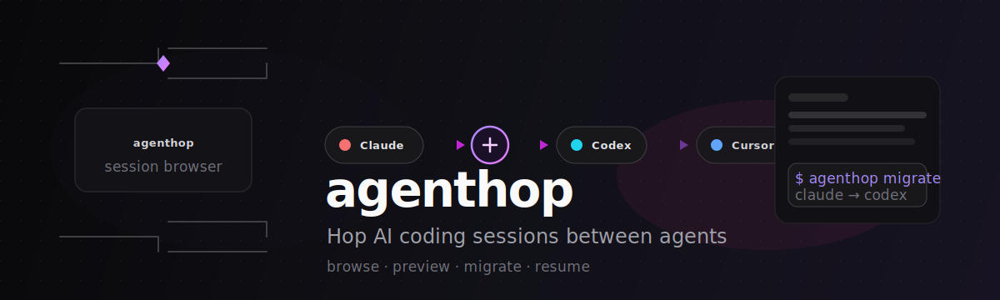

<div align="center">



<br/><br/>

[](https://github.com/CyrusSE/agenthop/actions/workflows/ci.yml)
[](https://github.com/CyrusSE/agenthop/releases)
[](https://goreportcard.com/report/github.com/CyrusSE/agenthop)
[](LICENSE)

**Hop AI coding sessions between agents** — fast indexed discovery, interactive TUI, and one-command migration.

[Install](#install) · [Quick start](#quick-start) · [Providers](#providers) · [Docs](docs/architecture.md)

</div>

---

## Why agenthop?

When you hit rate limits or want a different model mid-task, you shouldn't lose context. **agenthop** reads sessions from Claude Code, Codex, Cursor, OpenCode, CommandCode, Hermes (and more), then writes them in the target agent's native format so you can resume immediately.

| | |
|---|---|
| **Fast** | SQLite index at `~/.cache/agenthop/index.db` — list & search without rescanning thousands of JSONL files |
| **Safe** | Migration dedup via content digest — won't duplicate sessions on re-run |
| **Portable** | Export/import JSON bundles for backup or handoff |
| **Extensible** | Add a provider with one package + registry line |

## Install

```bash
# Release binary (linux / macOS)
curl -fsSL https://raw.githubusercontent.com/CyrusSE/agenthop/main/scripts/install.sh | bash

# Go install
go install github.com/CyrusSE/agenthop/cmd/agenthop@latest

# From source
git clone https://github.com/CyrusSE/agenthop.git && cd agenthop && make install
```

## Quick start

```bash
# Interactive TUI (default)
agenthop

# Index once (or per provider)
agenthop index rebuild --provider claude-code
agenthop index update --provider codex

# List & preview
agenthop list --provider claude-code --limit 20
agenthop show <session-id> --provider claude-code --limit 10

# Migrate & resume
agenthop migrate <session-id> --from claude-code --to codex -y
agenthop resume <session-id> --from claude-code --to codex

# Portable bundle
agenthop export <id> -o session.agenthop.json
agenthop import session.agenthop.json --to opencode -y
```

> **Tip:** `list` uses the cached index by default. Pass `--refresh` to rescan provider storage.

## Providers

| Agent | ID | Resume |
|-------|-----|--------|
| Claude Code | `claude-code` | `claude --resume <id>` |
| Codex | `codex` | `codex resume <id>` |
| Cursor CLI | `cursor` | `cursor-agent --resume <id>` |
| OpenCode | `opencode` | `opencode --session <id>` |
| CommandCode | `commandcode` | `commandcode --resume <id>` |
| Hermes | `hermes` | `hermes --session <id>` |

Verify paths: `agenthop providers doctor`

## TUI

```
◆ agenthop  session migrator

┌ Agents ──────┐  ┌ Sessions ────────────┐
│ Claude Code  │  │ 67417609  Fix auth bug │
│ Codex        │  │ 8a2f1c3e  Refactor API │
└──────────────┘  └────────────────────────┘
```

| Key | Action |
|-----|--------|
| `Enter` | Open provider / session / migrate target |
| `m` | Migrate selected session |
| `/` | Filter sessions |
| `r` | Refresh index |
| `c` | Copy resume command |
| `Esc` | Back · `q` quit |

## CLI reference

```bash
agenthop list [--provider ID] [--limit N] [--refresh]
agenthop show <id> [--provider ID]
agenthop migrate <id> --to <provider> [--from ID] [--dry-run] [-y]
agenthop resume <id> --to <provider> [--from ID]
agenthop index {status|rebuild|update} [--provider ID]
agenthop export <id> -o file.json
agenthop import file.json --to <provider>
agenthop providers [doctor]
```

## Development

```bash
make build test
./scripts/smoke.sh
```

See [CONTRIBUTING.md](CONTRIBUTING.md) and [docs/adding-a-provider.md](docs/adding-a-provider.md).

## Limitations

- Cursor **GUI** chat storage differs from CLI `cursor-agent` paths
- Tool/system messages may not round-trip on every target
- Claude Code resume may require `cd` to the original project directory

## License

MIT — see [LICENSE](LICENSE).

---

<sub>Prior art: [ctxmv](https://github.com/Ryu0118/ctxmv)</sub>
